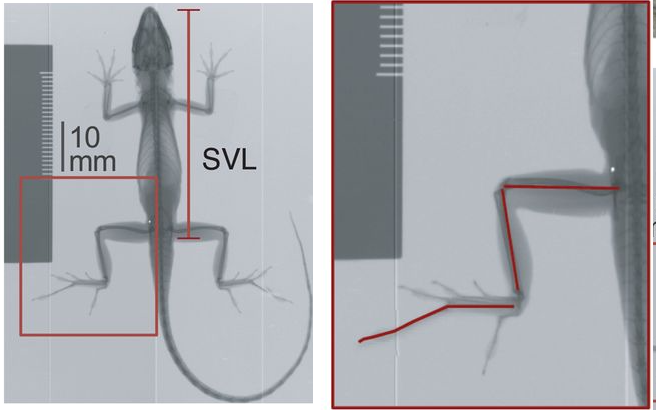

```{r setup, include=FALSE}
knitr::opts_chunk$set(echo = TRUE)
```

```{r libraries, include=FALSE}
library(tidyverse) #always have
library(ape) #for evo analysis
library(nlme) #for evo analysis
library(MuMIn) #for AIC
library(geiger) #for eco analysis
library(knitr) #for knitting options
library(rmarkdown)
library(phytools)
```

## R Markdown

# Introduction

Code-bearing text is wrapped in backticks: `ggplot`

We can also include links, using `[class site](https://bcorgbio.github.io/class/)`, which gives us [class site](https://bcorgbio.github.io/class/)

To insert a photo, we can say `` which will give us:


This image isn't centered on the page - let's use standard HTML tags to modify the position of elements: `<center> [](https://upload.wikimedia.org/wikipedia/commons/thumb/4/4b/Green_anole.jpg/320px-Green_anole.jpg) </center>` will give us:

<center>[](https://upload.wikimedia.org/wikipedia/commons/thumb/4/4b/Green_anole.jpg/320px-Green_anole.jpg)</center>

We can also add local images (in our directory) by name: `<center>  </center>` makes

<center></center>

To add equations, we use LaTeX: We can write `$$y=\alpha+\beta x$$` to produce: $$y=\alpha+\beta x$$ Notice how the equation is wrapped by two `$$`. A single `$` indicates the use of LaTeX markup and two indicates the equation should stand alone on a separate section

# Methods

# Results

```{r, "load the data"}
anole <- read_csv("anole.dat.csv")
anole.eco <- read_csv("anole.eco.csv")
anole.tree <- read.tree("anole.tre")
```

```{r, "join, filter, mutate to log"}
anole2 <- anole %>%
  left_join(anole.eco) %>%
  filter(!Ecomorph%in%c("U", "CH")) %>%
  na.omit()

anole.log <- anole2 %>%
  mutate_at(c("SVL", "HTotal", "PH", "ArbPD"),log)
```

```{r, "PGLS models"}
### phylogenetic GLS models

#PGLS under BM, no ecomorph:
pgls.BM1 <- gls(HTotal~SVL, correlation = corBrownian(1,phy=anole.tree, form=~Species), data=anole.log, method="ML")

#PGLS under BM, with ecomorph:
pgls.BM2 <- gls(HTotal~SVL*Ecomorph2, correlation=corBrownian(1,phy=anole.tree,form=~Species), data=anole.log, method="ML")

#PGLS under OU, no ecomorph:
pgls.OU1 <- gls(HTotal~SVL, correlation=corMartins(0,phy=anole.tree, form=~Species), data=anole.log, method="ML")

#PGLS under OU, with ecomorph:
pgls.OU2 <- gls(HTotal~SVL*Ecomorph2, correlation=corMartins(0,phy=anole.tree, form=~Species), data=anole.log, method="ML")

```

```{r, "AIC"}
#AIC operations
anole.phylo.aic <- AICc(pgls.BM1, pgls.BM2, pgls.OU1, pgls.OU2)
anole.phylow.aicw <- aicw(anole.phylo.aic$AICc)
```

```{r, "add residuals"}
#add phylo-corrected residuals
anole.log <- anole.log %>%
  mutate(phylo.res = residuals(pgls.BM2))
```

```{r, "plot residuals", fig.cap="Boxplot of phylogenetically corrected hindlimb residuals versus anole ecomorph"}
#plot residuals
p.eco.phylo <- anole.log %>%
  ggplot(aes(x = Ecomorph2, y = phylo.res)) + geom_boxplot() + stat_summary(fun=mean, geom="point", size=3)

print(p.eco.phylo)
```

We can make tables from our code by doing:

```{r, "tables from code"}
n.spec <- anole.log%>%
  group_by(Ecomorph2)%>%
  summarise(n.species=n())

n.spec%>%
  kable()

#or with caption:
n.spec%>%
  kable(caption = "Number of species within each anole ecormorph included in this study")

#for larger tables:
paged_table(anole.log, options = list(rows.print = 15))
```

We can also make tables by hand:

| Ecomorph     | Description                         |
|--------------|-------------------------------------|
| crown-giant  | Large bodied, lives in crown        |
| grass-bush   | Lives in grass or bushes            |
| trunk        | Lives on the trunk                  |
| trunk-crown  | Lives in the trunk-crown interface  |
| trunk-ground | Lives in the trunk-ground interface |
| twig         | Lives out on the twigs of trees     |

# Discussion

# Author Contributions

# References

This is an R Markdown document. Markdown is a simple formatting syntax for authoring HTML, PDF, and MS Word documents. For more details on using R Markdown see <http://rmarkdown.rstudio.com>.

When you click the **Knit** button a document will be generated that includes both content as well as the output of any embedded R code chunks within the document. You can embed an R code chunk like this:

```{r cars}
summary(cars)
```

## Including Plots

You can also embed plots, for example:

```{r pressure, echo=FALSE}
plot(pressure)
```

Note that the `echo = FALSE` parameter was added to the code chunk to prevent printing of the R code that generated the plot.
